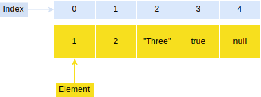

## What is Array? 

simply, An array is a collection of items of data stored at memory. Each value is called an element specified by an index.



example of array, here we can store string, number, null value, boolean value and float number. 

```js 
    
    let some_array = ["a", 12, true, null, "Hello World", 23.123]
```

## JavaScript Array

A JavaScript array has the following characteristics:

1. An array can hold values of mixed types. For example, you can have an array that stores elements with the types number, string, boolean, and null.

2. the size of an array is dynamic and auto-growing. In other words, you don’t need to specify the array size up front.

We can declare array like this way;

```js

    let a_Array = Array(5, 7)

    let new_Array = new Array(20, 10)

    let string_Array = new Array('My', 'Country', 'is', 'Bangladesh')

```

But in practical way we actually declare array like this;

```js 
    
    let modernArray = ["Bangladesh", 20, false]

```

----
Read More

1. [javascripttutorial.net - Array](https://www.javascripttutorial.net/javascript-array/)